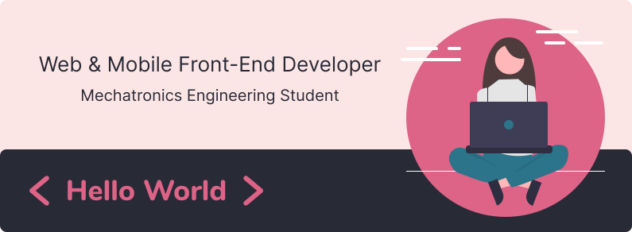

  

 
<h2>🛠 Technologies & Tools</h2>
  
    
    
    
    
    
    
    
    
    
    
  

   
  
 

  
  

<h3>Contact me:<h3>

                                                                                                                                            
                                                                                                                                            
---

  

  
